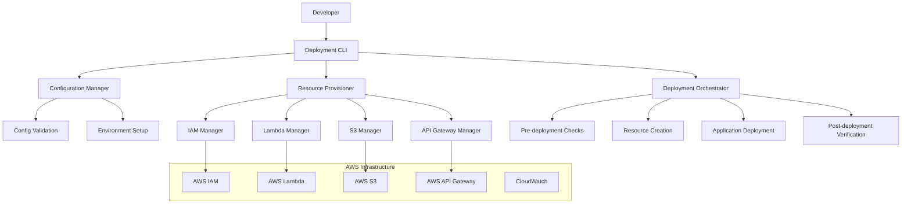

# Design Document

## Overview

The AWS Deployment Template system will provide a reusable, configurable infrastructure-as-code solution for deploying web applications to AWS. The system will be built around a core template engine that reads application configurations and generates the appropriate AWS resources using a combination of AWS CLI commands and CloudFormation templates. The design emphasizes simplicity, reusability, and adherence to AWS best practices while maintaining the flexibility to support various application architectures.

The system will consist of three main components: a Configuration Manager that handles application-specific settings, a Resource Provisioner that creates and manages AWS infrastructure, and a Deployment Orchestrator that coordinates the entire deployment process. This modular approach allows for easy extension and customization while maintaining a consistent deployment experience.

## Architecture

### High-Level Architecture



### Component Architecture

The system follows a modular design with clear separation of concerns:

1. **Configuration Layer**: Handles application-specific configuration, validation, and environment setup
2. **Provisioning Layer**: Manages AWS resource creation and updates using service-specific managers
3. **Orchestration Layer**: Coordinates the deployment process and handles error recovery
4. **Monitoring Layer**: Provides logging, health checks, and deployment verification

## Components and Interfaces

### Configuration Manager

**Purpose**: Manages application configuration, validates parameters, and provides environment-specific settings.

**Key Methods**:
- `loadConfig(configPath)`: Loads and validates deployment configuration
- `validateConfig(config)`: Ensures all required parameters are present and valid
- `resolveEnvironment(environment)`: Resolves environment-specific configuration
- `getResourceNames(config)`: Generates unique resource names based on configuration

**Configuration Schema**:
```yaml
application:
  name: string (required)
  type: "frontend" | "backend" | "fullstack" (required)
  version: string (optional, default: "1.0.0")

aws:
  region: string (optional, default: "us-east-1")
  profile: string (optional)

frontend:
  source_dir: string (required if type includes frontend)
  index_file: string (optional, default: "index.html")
  custom_domain: string (optional)

backend:
  source_dir: string (required if type includes backend)
  handler: string (required if type includes backend)
  runtime: string (optional, default: "nodejs22.x")
  timeout: number (optional, default: 60)
  memory: number (optional, default: 512)
  environment_variables: object (optional)

deployment:
  stack_name: string (optional, auto-generated)
  tags: object (optional)
  enable_monitoring: boolean (optional, default: true)
```

### Resource Provisioner

**Purpose**: Creates and manages AWS resources using service-specific managers.

#### IAM Manager
- Creates execution roles with least-privilege policies
- Manages service-linked roles and permissions
- Handles cross-service access policies

#### Lambda Manager
- Packages and deploys Lambda functions
- Configures function URLs or API Gateway integration
- Manages environment variables and runtime settings
- Handles function updates and versioning

#### S3 Manager
- Creates S3 buckets with appropriate configurations
- Sets up static website hosting
- Configures bucket policies and CORS settings
- Handles file uploads and cache settings

#### API Gateway Manager (Optional)
- Creates REST or HTTP APIs when needed
- Configures routes and integrations
- Sets up CORS and authentication
- Manages API stages and deployments

### Deployment Orchestrator

**Purpose**: Coordinates the entire deployment process and handles error recovery.

**Deployment Flow**:
1. **Pre-deployment Phase**:
   - Validate AWS credentials and permissions
   - Check for existing resources
   - Validate application code and dependencies

2. **Resource Creation Phase**:
   - Create IAM roles and policies
   - Provision compute resources (Lambda)
   - Set up storage resources (S3)
   - Configure networking and API resources

3. **Application Deployment Phase**:
   - Package and upload application code
   - Configure environment variables and settings
   - Deploy frontend assets to S3
   - Update Lambda function code

4. **Post-deployment Phase**:
   - Verify all resources are healthy
   - Run smoke tests
   - Output deployment information
   - Clean up temporary files

### Template Engine

**Purpose**: Generates CloudFormation templates and deployment scripts based on configuration.

**Template Types**:
- **Frontend-only**: S3 bucket with static website hosting
- **Backend-only**: Lambda function with Function URL or API Gateway
- **Full-stack**: Combined frontend and backend resources with proper integration
- **Custom**: Extensible template system for additional AWS services

## Data Models

### DeploymentConfig
```typescript
interface DeploymentConfig {
  application: ApplicationConfig;
  aws: AWSConfig;
  frontend?: FrontendConfig;
  backend?: BackendConfig;
  deployment: DeploymentSettings;
}

interface ApplicationConfig {
  name: string;
  type: 'frontend' | 'backend' | 'fullstack';
  version?: string;
}

interface AWSConfig {
  region?: string;
  profile?: string;
}

interface FrontendConfig {
  source_dir: string;
  index_file?: string;
  custom_domain?: string;
  build_command?: string;
}

interface BackendConfig {
  source_dir: string;
  handler: string;
  runtime?: string;
  timeout?: number;
  memory?: number;
  environment_variables?: Record<string, string>;
}

interface DeploymentSettings {
  stack_name?: string;
  tags?: Record<string, string>;
  enable_monitoring?: boolean;
}
```

### DeploymentResult
```typescript
interface DeploymentResult {
  success: boolean;
  resources: DeployedResource[];
  endpoints: Endpoint[];
  errors?: DeploymentError[];
  metadata: DeploymentMetadata;
}

interface DeployedResource {
  type: string;
  name: string;
  arn: string;
  status: 'created' | 'updated' | 'failed';
}

interface Endpoint {
  type: 'website' | 'api' | 'function_url';
  url: string;
  description: string;
}
```

## Error Handling

### Error Categories
1. **Configuration Errors**: Invalid or missing configuration parameters
2. **AWS Permission Errors**: Insufficient IAM permissions or invalid credentials
3. **Resource Conflicts**: Naming conflicts or resource limits
4. **Deployment Errors**: Failures during resource creation or application deployment
5. **Validation Errors**: Post-deployment health check failures

### Error Recovery Strategies
- **Retry Logic**: Automatic retry for transient AWS API errors
- **Rollback Capability**: Ability to revert to previous deployment state
- **Partial Recovery**: Continue deployment after resolving specific errors
- **Clean Failure**: Proper cleanup of partially created resources

### Error Reporting
- Structured error messages with actionable guidance
- Integration with AWS CloudWatch for centralized logging
- Detailed error context including AWS API responses
- Suggested remediation steps for common error scenarios

## Testing Strategy

### Unit Testing
- **Configuration Manager**: Test configuration validation and parsing
- **Resource Managers**: Mock AWS API calls and test resource creation logic
- **Template Engine**: Validate generated CloudFormation templates
- **Orchestrator**: Test deployment flow and error handling

### Integration Testing
- **AWS Integration**: Test actual resource creation in isolated AWS account
- **End-to-End Deployment**: Deploy sample applications and verify functionality
- **Cross-Region Testing**: Validate deployment across different AWS regions
- **Permission Testing**: Test with various IAM permission scenarios

### Test Applications
Create sample applications for testing different deployment scenarios:
1. **Static Website**: Simple HTML/CSS/JS frontend
2. **Serverless API**: Node.js Lambda function with REST endpoints
3. **Full-Stack App**: React frontend with Express.js backend
4. **Multi-Environment**: Application with dev/staging/prod configurations

### Automated Testing Pipeline
- **Pre-commit Hooks**: Validate configuration schemas and run unit tests
- **CI/CD Integration**: Automated testing on pull requests
- **Deployment Validation**: Automated deployment and teardown of test applications
- **Security Scanning**: Static analysis of generated CloudFormation templates

### Performance Testing
- **Deployment Speed**: Measure time to deploy various application types
- **Resource Optimization**: Validate cost-effective resource configurations
- **Scalability Testing**: Test deployment of multiple applications simultaneously
- **Update Performance**: Measure time for application updates and rollbacks

## Security Considerations

### IAM Security
- Implement least-privilege access policies for all resources
- Use service-linked roles where possible
- Avoid embedding credentials in configuration files
- Support AWS credential providers (profiles, environment variables, IAM roles)

### Data Protection
- Encrypt sensitive environment variables using AWS Systems Manager Parameter Store
- Use S3 bucket encryption for static assets
- Implement secure CORS policies for cross-origin requests
- Validate and sanitize all configuration inputs

### Network Security
- Configure appropriate S3 bucket policies for public/private access
- Implement API Gateway throttling and authentication when needed
- Use HTTPS for all endpoints
- Support VPC integration for Lambda functions when required

### Monitoring and Auditing
- Enable CloudTrail logging for all AWS API calls
- Configure CloudWatch alarms for critical metrics
- Implement deployment audit logs
- Support integration with AWS Config for compliance monitoring